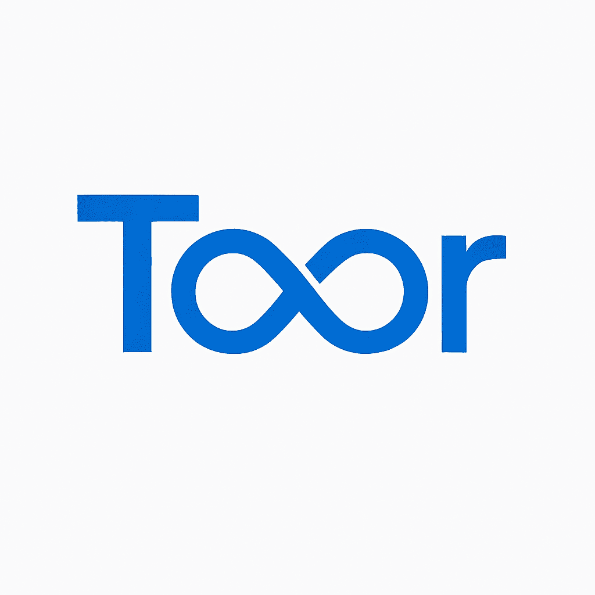

# 👋 Welcome to Toor Connect

## 🚀 About Us

**Toor Connect** is a technology company specializing in high-quality embedded software solutions, with a focus on communications and the Internet of Things (IoT). We offer customized solutions that cover the entire project lifecycle—from requirements definition to final validation and testing—always aligned with the specific needs of each client.

Our top-down approach begins with understanding the business logic and defining clear objectives. Once we have a clear vision, we proceed to develop the implementation, focusing on creating flexible, cross-platform solutions that facilitate agile transitions between different hardware architectures.

At Toor, we are deeply involved in every project, striving to deliver the highest quality solutions. Our priority is to develop systems that are not only functional but also secure, high-performing, and scalable. Innovation defines us, and we constantly seek new ways to improve through continuous integration and close collaboration with our clients, ensuring constant support and agile adaptation to the changing market needs.

## 🛠️ What We Do

- Embedded Software Development
- IoT Solutions
- Communication Protocols
- Full Project Lifecycle Support
- Cross-Platform Development
- Continuous Integration and Support

## 🌍 Location

📍 Vic, Spain

## 📫 Connect With Us

- 🌐 [LinkedIn](https://www.linkedin.com/company/toor-connect/)
- 📧 [Email](narcisoriol@toorconnect.com)
